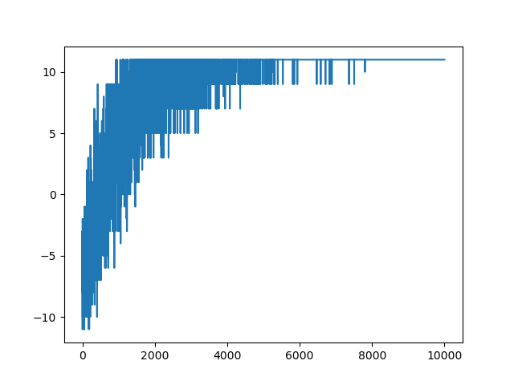
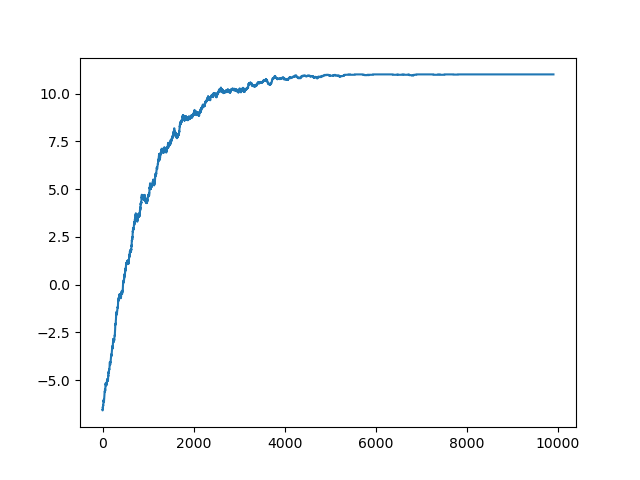
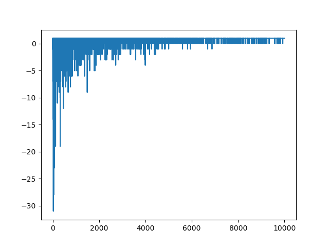
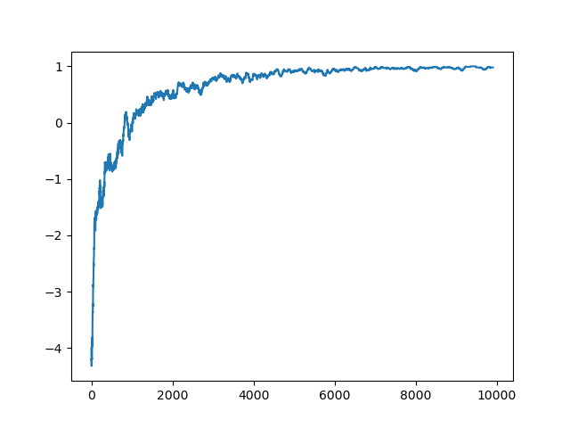

# Simple Q Reinforcement Learning framework in pure C++23

## Examples

### Rock Paper Scissor

A sample Rock-Paper-Scissor-Like environment is there in include files.
For a simulation you need an $Environment$ object and a $Agent$ object. NO MARL for now.
The $RockPaperScissorLike$ class implements a Rock Paper Scissor game with K alternatives, each one winning only on the precedent and loosing against all the others.
The game at each step present the agent with one of those alternatives (such as ROCK) and the agent should pick an action to win against it.
If it chooses SCISSOR it loses -1.0 reward, with ROCK is stays even (0.0 reward), with PAPER it wins 1.0 reward. As simple as this.
Each episode lasts for 11 rounds.

Here is the learning curve over time of the agent:

From its moving average we get a clearer picture of its evoluton:

### Tris

The agent always starts as first but the environment allows also for it to start second.

Here is the learning curve over time of the agent:

From its moving average we get a clearer picture of its evoluton:

